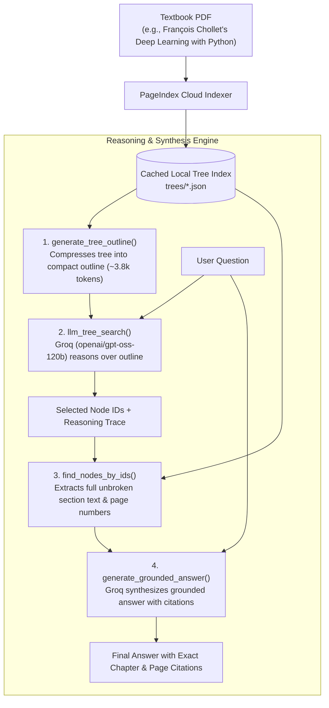

# 📚 Vectorless RAG for Machine Learning & Deep Learning Textbooks

A reasoning-based, **Vectorless Retrieval-Augmented Generation (RAG)** system built on top of [PageIndex](https://github.com/VectifyAI/PageIndex) and [Groq](https://groq.com) (`openai/gpt-oss-120b`).

Unlike traditional RAG, this engine does **not** rely on chunking, vector embeddings, or vector databases. Instead, it reads and reasons over the natural **hierarchical tree index** of comprehensive textbooks (Chapters $\rightarrow$ Sections $\rightarrow$ Subsections $\rightarrow$ Pages) just like a human research librarian.

---

## 💡 Why Vectorless RAG?

In traditional RAG pipelines, long technical books are sliced into arbitrary 500-token chunks. This creates severe issues:
1. **`Similarity ≠ Relevance`**: Vector embeddings match based on semantic proximity of words, not architectural or mathematical relevance. A query about *Batch Normalization* might match an introductory mention in Chapter 1 instead of the deep architectural analysis in Chapter 9.
2. **Context Fragmentation**: Mathematical derivations, code listings, and architectural explanations spanning multiple pages get butchered across arbitrary chunk boundaries.
3. **Black Box Retrieval**: Traditional vector similarity offers no explainability or audited reasoning for *why* a chunk was retrieved.

### Vector RAG vs. Vectorless RAG Comparison

| Aspect | Traditional Vector RAG | Vectorless RAG (PageIndex + Groq) |
|---|---|---|
| **Document Representation** | 500-token text chunks | Hierarchical Document Tree (Table of Contents + Summaries) |
| **Storage** | Vector Database (FAISS, Chroma, Pinecone) | Lightweight JSON Tree Index (Cached locally) |
| **Retrieval Mechanism** | Cosine similarity on dense vectors | LLM Step-by-Step Reasoning over the Tree |
| **Context Quality** | Fragmented, truncated text windows | Full, contiguous textbook sections as authored |
| **Attribution** | Opaque similarity score | Exact chapter, subsection title, and book page numbers |

---

## 🏗️ Architecture & Pipeline



---

## 📁 Repository Structure

```text
vectorlessrag/
├── trees/                               # Local cache for generated tree indices (ignored by git)
│   └── Deep_Learning_with_Python_tree.json
├── index_book.py                        # Ingestion script to upload & build tree indices via PageIndex
├── inspect_tree.py                      # Diagnostic CLI to browse trees and inspect specific nodes
├── rag_engine.py                        # Core Vectorless RAG engine (Search, Retrieval, Synthesis)
├── .env                                 # API Keys: PAGEINDEX_API_KEY, GROQ_API_KEY (ignored by git)
├── .gitignore                           # Git ignore rules (.venv, .env, trees/, cache)
└── README.md                            # Documentation
```

---

## ⚡ Quickstart & Setup

### 1. Prerequisites
- Python 3.10+
- A [PageIndex API Key](https://dash.pageindex.ai/api-keys)
- A [Groq Cloud API Key](https://console.groq.com)

### 2. Environment Setup
Clone the repository and install dependencies in a virtual environment:

```powershell
python -m venv .venv
.\.venv\Scripts\Activate.ps1
pip install pageindex groq python-dotenv pypdfium2
```

### 3. Configure API Keys
Create a `.env` file in the root directory:

```env
PAGEINDEX_API_KEY=your_pageindex_key_here
GROQ_API_KEY=your_groq_key_here
```

---

## 🛠️ Usage Guide

### Step 1: Index a Textbook
Run `index_book.py` to upload a textbook PDF and build its hierarchical tree index. Once indexed, the tree is permanently cached in `trees/` for instant, cost-free queries.

```powershell
.\.venv\Scripts\python index_book.py --book 2
```

### Step 2: Inspect the Book Tree
You can browse the generated document tree or inspect specific sections by node ID:

```powershell
# View the entire table of contents hierarchy
.\.venv\Scripts\python inspect_tree.py

# Inspect a specific node (e.g., node 0163: Understanding self-attention)
.\.venv\Scripts\python inspect_tree.py 1 0163
```

### Step 3: Run the Vectorless RAG Engine
Launch `rag_engine.py` for interactive Q&A over the textbook:

```powershell
.\.venv\Scripts\python rag_engine.py
```

You can choose from pre-curated benchmark queries or type your own question.

---

## 🧪 Benchmark Sample Queries

The engine includes pre-configured sample questions covering the primary pillars of Deep Learning:

| # | Question | Target Section | Key Concepts Covered |
|---|---|---|---|
| **1** | *How do residual connections work and why are they important?* | Section 9.3.2 (p. 276–280) | Vanishing gradients, shortcut formulation $y = F(x) + x$, $1 \times 1$ projections |
| **2** | *What is self-attention and how does it compute representations in Transformers?* | Section 11.4.1 (p. 362–366) | Query-Key-Value dot-product, softmax scaling, contextual representations |
| **3** | *Explain the difference between Batch Normalization and standard feature scaling.* | Section 9.3.3 (p. 280–282) | Internal covariate shift, running mean & variance, learnable affine parameters ($\gamma, \beta$) |
| **4** | *What is the convolution operation and how do convnets process visual patterns?* | Section 8.1.1 (p. 229–234) | Translation invariance, spatial hierarchies, filter patches, feature maps |
| **5** | *How does gradient descent and backpropagation work mathematically in neural networks?* | Section 2.4–2.5 (p. 49–59) | Chain rule, tensor operations, gradient updates, learning rates |
| **6** | *What is the difference between Variational Autoencoders (VAEs) and Generative Adversarial Networks (GANs)?* | Section 12.4–12.5 (p. 416–436) | Latent space sampling, reconstruction loss vs. min-max adversarial game |
| **7** | *What strategies exist to prevent overfitting in deep neural networks?* | Section 5.3 (p. 136–143) | L1/L2 weight regularization, dropout, data augmentation, early stopping |

---

## 📜 Grounded Citation Example

When queried:
> *"How do residual connections work and why are they used?"*

The system extracts Section `0127` and synthesizes an answer with exact citations:
> *"A residual connection is a shortcut that adds the input of a layer directly to its output ($y = F(x) + x$), forcing the block to preserve a non-destructive copy of the original signal (Section: '9.3.2 Residual connections', Pages 276-277). In deep chains, intermediate non-linearities attenuate error signals; the residual shortcut provides an unobstructed gradient highway to early layers, preventing vanishing gradients (Page 279)..."*

---

## 🗺️ Roadmap
- [x] **Step 1:** Environment setup & Groq API authentication.
- [x] **Step 2:** PageIndex book ingestion & local tree caching.
- [x] **Step 3:** Reasoning-based tree search (`llm_tree_search`).
- [x] **Step 4:** Node extraction & grounded synthesis with citations (`generate_grounded_answer`).
- [ ] **Step 5:** ML & DL domain expert routing heuristics.
- [ ] **Step 6:** Interactive Streamlit dashboard with side-by-side tree browser and citation viewer.
